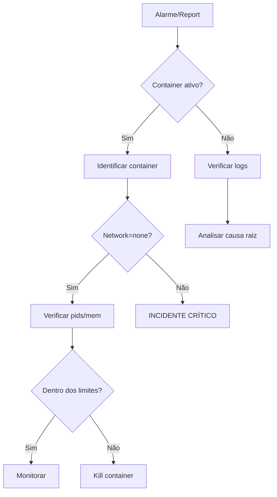

# Incident Response Playbook — Sandbox Escape / Security Event

> **Propósito**: Guia de resposta para incidentes de segurança no Simples Editor.
> Foco principal: escape de sandbox, abuso de execução, e comprometimento do backend.
> **Público-alvo**: Equipe de plataforma / administradores do sistema.

---

## Índice

1. [Matriz de severidade](#1-matriz-de-severidade)
2. [Incidentes conhecidos e resposta](#2-incidentes-conhecidos-e-resposta)
   - [2.1 Loop infinito não interrompido](#21-loop-infinito-não-interrompido)
   - [2.2 Fork bomb ou esgotamento de PIDs](#22-fork-bomb-ou-esgotamento-de-pids)
   - [2.3 Exfiltração de dados via rede](#23-exfiltração-de-dados-via-rede)
   - [2.4 Escape do container Docker](#24-escape-do-container-docker)
   - [2.5 Abuso de execuções (rate limit bypass)](#25-abuso-de-execuções-rate-limit-bypass)
   - [2.6 JWT comprometido](#26-jwt-comprometido)
   - [2.7 Vazamento de container (container leak)](#27-vazamento-de-container-container-leak)
   - [2.8 Code injection no backend](#28-code-injection-no-backend)
3. [Procedimento geral de resposta](#3-procedimento-geral-de-resposta)
4. [Pós-incidente](#4-pós-incidente)
5. [Checklist de recovery](#5-checklist-de-recovery)
6. [Contatos](#6-contatos)

---

## 1. Matriz de severidade

| Severidade | Cor | Definição | SLA de resposta |
|------------|-----|-----------|-----------------|
| **Crítico** | 🔴 | Escape de sandbox confirmado ou comprometimento do host | Imediato (≤ 15 min) |
| **Alto** | 🟠 | Abuso de recursos que afeta múltiplos usuários | ≤ 1 hora |
| **Médio** | 🟡 | Violação de rate limit, container leak isolado | ≤ 4 horas |
| **Baixo** | 🟢 | Alarme falso, tentativa bloqueada sem dano | ≤ 24 horas |

---

## 2. Incidentes conhecidos e resposta

### 2.1 Loop infinito não interrompido

**Sintomas**:
- Container continua rodando após 15s do timeout configurado
- CPU elevada no host por processo do sandbox
- Reclamação de usuário sobre execução "travada"

**Camadas de defesa esperadas**:
1. `asyncio.wait_for` com timeout de 10s (wall-clock)
2. SIGTERM → 1s → SIGKILL
3. `--stop-timeout=12` no container Docker

**Resposta**:

| Passo | Ação | Responsável |
|-------|------|-------------|
| 1 | Verificar containers ativos: `docker ps --filter name=sim-*` | Plantonista |
| 2 | Identificar container pelo timestamp: `docker inspect <id> \| jq '.[].Created'` | Plantonista |
| 3 | Matar manualmente: `docker kill --signal=SIGKILL <id>` | Plantonista |
| 4 | Remover: `docker rm -f <id>` | Plantonista |
| 5 | Verificar logs do backend: `docker logs backend --since 5m` | Plantonista |
| 6 | Se recorrente, escalar para investigação do timeout handler | Dev lead |

**Mitigação permanente**:
- Ajustar `EXEC_TIMEOUT_S` para 8s (mais conservador)
- Adicionar alerta em `simples_active_sandboxes` > 50

---

### 2.2 Fork bomb ou esgotamento de PIDs

**Sintomas**:
- Container atinge `pids_limit=64` e é OOM-killed pelo cgroup
- Log: `docker: ResourceExhaustedError: pids limit`
- Host com carga alta repentina

**Camadas de defesa esperadas**:
1. `--pids-limit=64` no container
2. Cgroups do Docker limitam forks

**Resposta**:

| Passo | Ação | Responsável |
|-------|------|-------------|
| 1 | Verificar se o container foi automaticamente morto pelo Docker | Plantonista |
| 2 | Confirmar pelo log: `docker logs backend \| grep "pids limit"` | Plantonista |
| 3 | Se container ainda ativo: `docker kill <id>` | Plantonista |
| 4 | Verificar se há múltiplos containers do mesmo usuário (abuso) | Plantonista |
| 5 | Identificar user_id nos logs e bloquear temporariamente via rate limit | Plantonista |

**Mitigação permanente**:
- Reduzir `pids_limit` para 32 se falso positivo for aceitável
- Implementar auditoria de código suspeito (regex por `fork`)

---

### 2.3 Exfiltração de dados via rede

**Sintomas**:
- Tráfego de saída detectado do container sandbox (impossível por design)
- Tentativa de conexão bloqueada (logs do Docker)

**Camadas de defesa esperadas**:
1. `--network=none` — container sem interface de rede

**Resposta**:

| Passo | Ação | Responsável |
|-------|------|-------------|
| 1 | Confirmar que `--network=none` está presente: `docker inspect <id> \| jq '.[].HostConfig.NetworkMode'` | Plantonista |
| 2 | Se network_mode não for "none", incidente crítico — container foi modificado | Plantonista |
| 3 | Verificar logs do daemon Docker: `journalctl -u docker --since 5m` | Dev lead |
| 4 | Isolar o host da rede se necessário: `iptables -A INPUT -s <ip> -j DROP` | Dev lead |
| 5 | Escalar para segurança da instituição | Coordenador |

**Mitigação permanente**:
- Validar `network_mode` em código (teste unitário no `SandboxFactory`)
- Adicionar monitoramento de tráfego de saída nos hosts Docker

---

### 2.4 Escape do container Docker

**Sintomas**:
- Arquivos criados fora do container no host
- Processos do host sendo manipulados a partir do sandbox
- Usuário `nobody` (UID 65534) aparece em operações fora do esperado

**Camadas de defesa esperadas**:
1. `--user=65534:65534` (nobody)
2. `--cap-drop=ALL`
3. Seccomp profile padrão do Docker
4. `--read-only` (filesystem imutável)
5. Sem montagem do socket Docker

**Resposta**:

| Passo | Ação | Responsável |
|-------|------|-------------|
| **CRÍTICO** | Isolar o host imediatamente: remover da rota do Nginx | Plantonista |
| 2 | Parar o backend: `docker compose stop backend` | Plantonista |
| 3 | Coletar evidências: `docker inspect <id> > /tmp/escape-$(date +%s).json` | Plantonista |
| 4 | Salvar logs: `docker logs backend > /tmp/backend-$(date +%s).log` | Plantonista |
| 5 | Salvar syslog: `journalctl -u docker --since 1h > /tmp/docker-$(date +%s).log` | Plantonista |
| 6 | Verificar se o host foi comprometido: `rkhunter --check` ou `chkrootkit` | Dev lead |
| 7 | Rotacionar todas as chaves e segredos do ambiente (Supabase JWT, etc.) | Coordenador |
| 8 | Notificar a equipe de segurança da instituição e a coordenação do curso | Coordenador |

**Mitigação permanente**:
- Adicionar `--security-opt=no-new-privileges`
- Considerar `gVisor` ou `Firecracker` para isolamento mais forte (v2)
- Auditoria mensal das flags de segurança do Docker

---

### 2.5 Abuso de execuções (rate limit bypass)

**Sintomas**:
- Mais de 30 execuções/minuto de um mesmo `user_id`
- Mais de 120 execuções/minuto de um mesmo IP
- Backend com latência alta, fila de execução crescente

**Camadas de defesa esperadas**:
1. Rate limit por `user_id`: 30 exec/min (`flask-limiter`)
2. Rate limit por IP: 120 exec/min

**Resposta**:

| Passo | Ação | Responsável |
|-------|------|-------------|
| 1 | Identificar user_id ou IP abusivo nos logs | Plantonista |
| 2 | Bloquear manualmente: adicionar à blacklist no Redis ou config | Plantonista |
| 3 | Verificar se é um aluno legítimo com script automatizado | Plantonista |
| 4 | Notificar o usuário (se identificado) sobre uso aceitável | Plantonista |
| 5 | Se for ataque automatizado, manter bloqueio e escalar | Dev lead |

**Mitigação permanente**:
- Implementar rate limit no Nginx (pré-backend) para proteção adicional
- Adicionar captcha para execuções frequentes (opcional)
- Logging de rate limit hits para análise

---

### 2.6 JWT comprometido

**Sintomas**:
- Requests com JWT válido de um IP inesperado
- Múltiplos user_ids diferentes do mesmo IP
- Acesso a recursos de outro usuário (impossível em v1, mas monitorar)

**Camadas de defesa esperadas**:
1. JWT expira em 1h (padrão Supabase)
2. Backend valida `sub` e `exp` em toda requisição

**Resposta**:

| Passo | Ação | Responsável |
|-------|------|-------------|
| 1 | Identificar o usuário afetado pelo `sub` do JWT | Plantonista |
| 2 | Invalidar sessões no Supabase (revogar tokens do usuário) | Plantonista |
| 3 | Solicitar que o usuário troque a senha | Plantonista |
| 4 | Verificar logs de acesso do usuário para atividades suspeitas | Dev lead |
| 5 | Se for JWT de serviço (anon key), rotacionar imediatamente | Coordenador |

**Mitigação permanente**:
- Implementar RLS (Row-Level Security) nas tabelas futuras (v2)
- Logging de user_id em todas as operações

---

### 2.7 Vazamento de container (container leak)

**Sintomas**:
- `docker ps` mostra containers parados ou em execução por horas
- Uso de disco crescente (camadas de container não removidas)
- Número de containers excede o esperado (deveria ser ~0 em idle)

**Camadas de defesa esperadas**:
1. `container.remove(force=True)` no finally do executor
2. Cron de limpeza diário

**Resposta**:

| Passo | Ação | Responsável |
|-------|------|-------------|
| 1 | Listar containers órfãos: `docker ps -a --filter name=sim-* --format '{{.ID}} {{.CreatedAt}}'` | Plantonista |
| 2 | Remover todos os containers órfãos: `docker rm -f $(docker ps -a -q --filter name=sim-*)` | Plantonista |
| 3 | Verificar logs do backend para identificar a causa do leak | Dev lead |
| 4 | Se aplicável, corrigir o handler de exceção que pulou o `finally` | Dev lead |

**Mitigação permanente**:
- Cron job: `0 3 * * * docker container prune --filter label=simples-sandbox --force`
- Métrica `simples_active_sandboxes` com alerta se > threshold por > 5 min

---

### 2.8 Code injection no backend

**Sintomas**:
- Comandos arbitrários executados no host backend
- Logs com comandos inesperados
- Arquivos modificados no backend

**Camadas de defesa esperadas**:
1. Backend usa `subprocess.run` com lista de args (nunca `shell=True`)
2. Validação de código (tamanho, caracteres, UTF-8)

**Resposta**:

| Passo | Ação | Responsável |
|-------|------|-------------|
| **CRÍTICO** | Parar o backend: `docker compose stop backend` | Plantonista |
| 2 | Isolar o host da rede | Plantonista |
| 3 | Coletar logs completos do backend | Dev lead |
| 4 | Identificar o código malicioso que causou a injeção | Dev lead |
| 5 | Corrigir a vulnerabilidade e fazer deploy | Dev lead |
| 6 | Auditoria completa do host (rootkits, backdoors) | Coordenador |

**Mitigação permanente**:
- Sempre usar lista de args em `subprocess.run`
- Adicionar `shell=True` detector em code review
- Testes de fuzzing no validador de entrada

---

## 3. Procedimento geral de resposta

### 3.1 Triage (primeiros 5 minutos)



### 3.2 Comunicação

| Canal | Quando usar |
|-------|-------------|
| Notificação automática (cron/alertmanager) | Alarme de métrica (`simples_active_sandboxes`, `simples_executions_total`) |
| Grupo da equipe (WhatsApp/Telegram) | Incidente de severidade Alta ou Crítica |
| Email institucional | Pós-incidente (relatório completo) |
| Sala de aula / Professor | Se um aluno específico estiver envolvido |

### 3.3 Escalação

```
Plantonista (N1) ── não resolve em 15min? ──> Dev lead (N2) ──> Coordenador (N3)
```

- **N1 (Plantonista)**: Estudante da equipe em rodízio semanal
- **N2 (Dev lead)**: Carlos Barbosa (carlos.barbosa@ifsuldeminas.edu.br)
- **N3 (Coordenador)**: Professor responsável pela disciplina

---

## 4. Pós-incidente

Após resolução de qualquer incidente de severidade **Alta** ou **Crítica**:

1. **Reunião post-mortem** em até 48h
2. **Documentar** no final deste arquivo (seção 4.1)
3. **Atualizar** as camadas de defesa se aplicável
4. **Testar** a correção com cenário reproduzível
5. **Compartilhar** lições aprendidas com a equipe

### 4.1 Registro de incidentes

| Data | Severidade | Tipo | Resumo | Responsável | Ações tomadas |
|------|------------|------|--------|-------------|---------------|
| — | — | — | — | — | — |

---

## 5. Checklist de recovery

Após um incidente crítico, seguir esta ordem:

- [ ] Host isolado da rede (se aplicável)
- [ ] Backend parado
- [ ] Evidências coletadas (logs, inspect, syslog)
- [ ] Container malicioso removido
- [ ] Host verificado (rootkits, backdoors)
- [ ] Segredos rotacionados (JWT secret, Supabase keys)
- [ ] Código corrigido e revisado
- [ ] Deploy da correção em staging
- [ ] Testes de segurança executados
- [ ] Deploy em produção
- [ ] Post-mortem realizado
- [ ] Documentação atualizada

---

## 6. Contatos

| Papel | Nome | Email | Telefone |
|-------|------|-------|----------|
| Dev lead | Carlos Barbosa | carlos.barbosa@ifsuldeminas.edu.br | — |
| Professor | — | — | — |
| Administrador Supabase | — | — | — |
| Administrador OCI | — | — | — |
| Segurança institucional | — | — | — |
